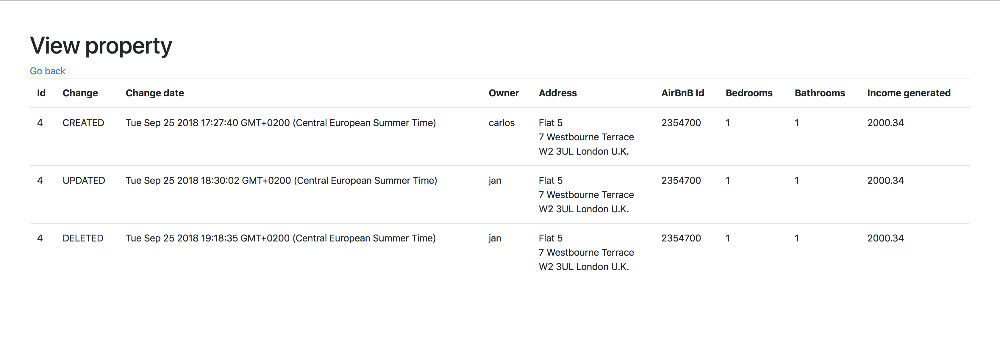

# Example crud

## Notes

### Arch style

> Please use any choice of architecture pattern – either a standard server side rendered web-page or Web-Api that is used by JavaScript on the page.
> We would like to see if you can reason your choice.

SSR is used when:
- we need to make sure the website is easily accessible by clients without javascript (search engine bots for example)
- we want to reduce time it takes for users to see first content

CSR is used when:
- we want to minimize data sent over the network
- we want fast rendering after the initial load

We can use both approaches, so we SSR the initial page with some content and then use CSR to handle page navigation and other dynamic content.

In this assigment I used a simple SSR site with handlebars templates and a little bit of JS on the front-end to send forms because it's an admin panel that doesn't need extreme performance (not that it doesn't matter completely, but the focus should be on user facing apps), we don't have complex state to manage, it was faster to build.

## Running

### Software needed
- node
- npm
- docker / docker-compose

### Clone repository / download zip

```
git clone git@bitbucket.org:slonka/hostmaker.git
```

### Cd into it

```
cd hostmaker
```

### Start the database

```
docker-compose -f docker/mysql.yml up
```

### Install dependencies

```
npm install
```

### Run migrations

```
node node_modules/.bin/sequelize db:migrate
```

### Run tests

```
npm test
```

### Start server

```
npm start
```

Visit http://localhost:3000/ in your browser

From there you can see a list of properties 

Below you can see the form to add a property.

Clicking on property id you will see changes made to that entity 

### Postman

You can find postman collection and environment in `./postman/` folder.

## Deployment

### Heroku

Add MYSQL_USERNAME, MYSQL_PASSWORD, MYSQL_DATABASE, MYSQL_HOST env variables, push to heroku git repository.

You can see a deployed version here: https://hostmaker-assignment.herokuapp.com/
